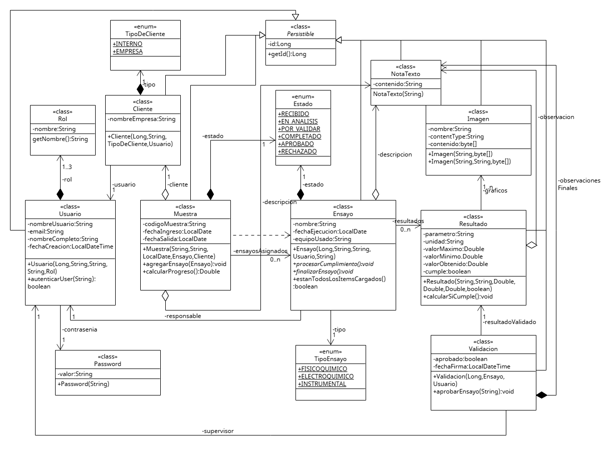
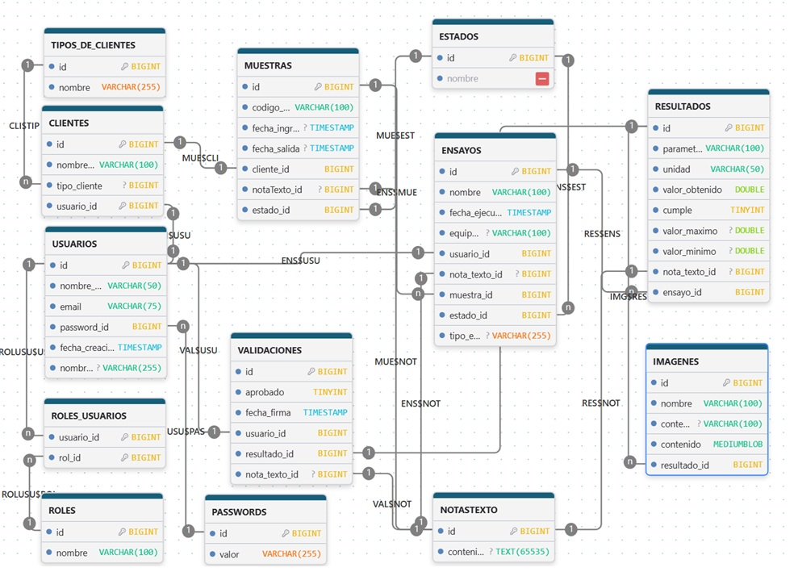

# LabHelper
Sistema de gestión de laboratorio para registrar, organizar y dar seguimiento al ciclo completo de análisis de muestras,ensayos y resultados.
---
**PROGRAMA INTENSIVO- CODIGO MARIANO**
---
## Cuarta semana
### Objetivos

- [x] Diseñar estructura de Base de Datos. 
- [x] Mapear entidades persistibles.
- [x] Implementar Spring.

### DIAGRAMA UML
**LabHelper_v6**

 

### DIAGRAMA BASE DE DATOS
Utilizando https://www.drawdb.app/. 

 