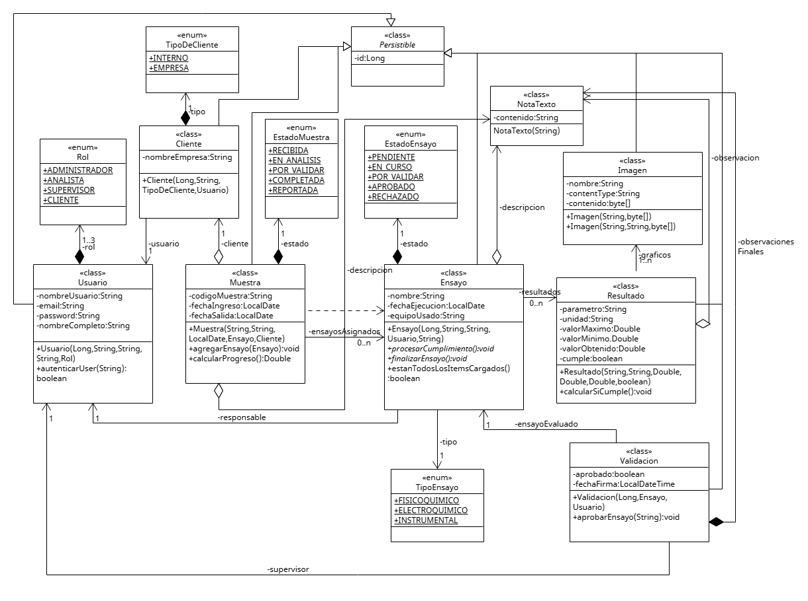

# LabHelper
Sistema de gestión de laboratorio para registrar, organizar y dar seguimiento al ciclo completo de análisis de muestras,ensayos y resultados.
---
**PROGRAMA INTENSIVO- CODIGO MARIANO**
---
## Tercera semana
### Objetivos

- [x] Incorporar Maven 
- [x] Clase Main que implemente el circuito planteado

### DIAGRAMA UML
**LabHelper_v5**

